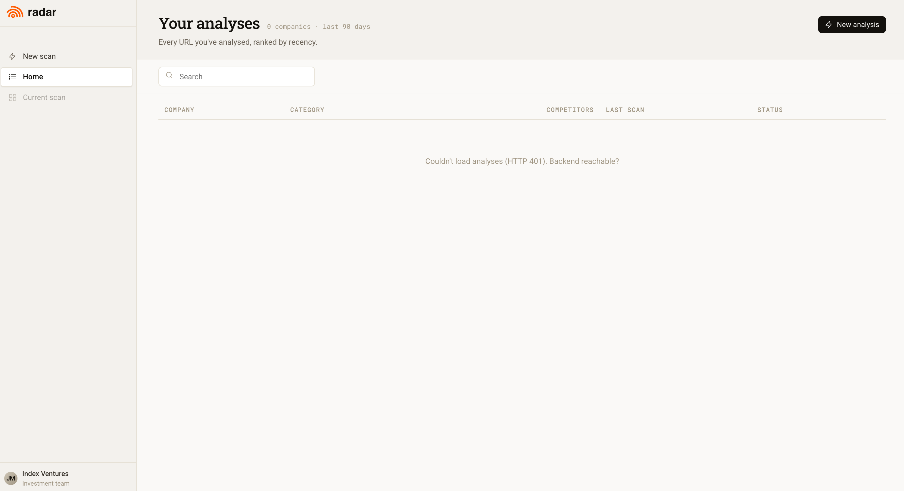
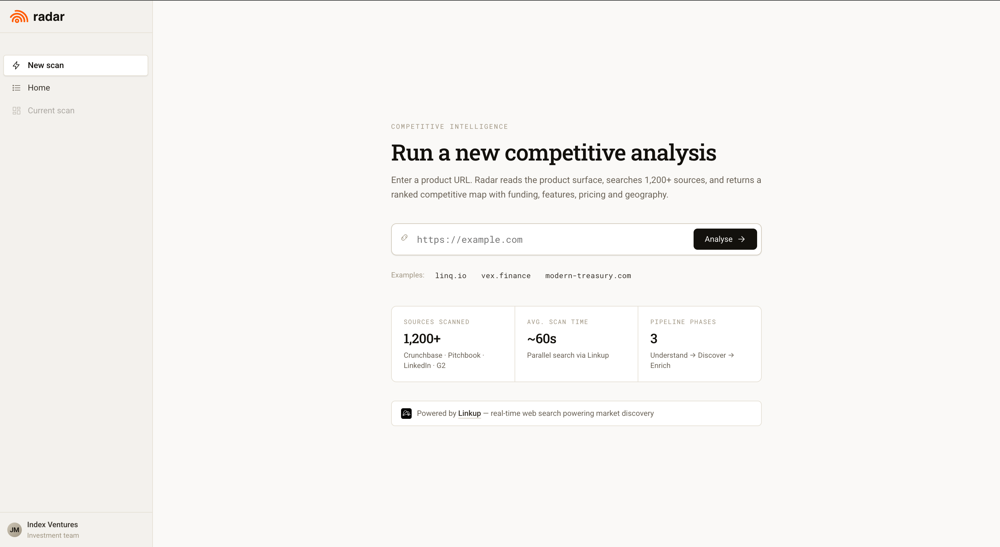

# RADAR

**Competitive intelligence for VCs.** Paste a startup URL → get a structured competitive memo (company profile, ranked competitors, pricing signals, positioning maps) in under 60 seconds.

Built during the **Linkup hackathon** — philosophy: ship > perfect.

---

## Demo

- **Live app:** https://frontend-prototype-opal.vercel.app (password-gated — ask for the access token)
- **Backend API:** https://radar-backend-je6o.onrender.com

**New scan** — paste a product URL, get a ranked competitive map in ~60s:



**Your analyses** — every URL you've scanned, ranked by recency:



---

## What it does

```
URL startup
    ↓
[PHASE 1 — UNDERSTAND] ~15s
  Linkup /search + /fetch Crunchbase → CompanyProfile
    ↓
[PHASE 2 — DISCOVER] ~20s
  Linkup /search deep → ~15 competitors, deduplicated by website
    ↓
[PHASE 3 — ENRICH] ~60s
  Linkup /tasks batch + /fetch pricing → CompetitorProfile × N + PricingSignals
    ↓
JSON → Claude extraction → React frontend (Overview, Map, Pricing, Timeline, Positioning)
```

---

## Prerequisites

- **Python 3.11+** (backend)
- A modern browser + any static file server (frontend is build-free)
- API keys:
  - **`LINKUP_API_KEY`** — search/fetch engine ([linkup.so](https://linkup.so))
  - **`ANTHROPIC_API_KEY`** — Claude extraction (model `claude-sonnet-4-20250514`)
  - **`NOMINATIM_USER_AGENT`** — required by OpenStreetMap geocoding ToS
- Optional:
  - **`BRAINTRUST_API_KEY`** — only if you run evals
  - **`SUPABASE_URL` + `SUPABASE_SERVICE_KEY`** — persistence; falls back to local JSON cache if absent

> 💸 **Cost note:** a full pipeline run costs ~€0.60 on Linkup (a 15-item batch scan can hit ~€4.50). Use the mocks in `backend/tests/fixtures/` for debugging loops — never loop a real pipeline.

---

## Installation

### Backend

```bash
cd radar/backend
python3 -m venv .venv
source .venv/bin/activate
pip install -r requirements.txt
```

Create `radar/backend/.env` (never commit it — see `.env.example`):

```bash
LINKUP_API_KEY=lp-xxxxxxxx
ANTHROPIC_API_KEY=sk-ant-xxxxxxxx
NOMINATIM_USER_AGENT=radar-hackathon
# optional
BRAINTRUST_API_KEY=xxxxxxxx
SUPABASE_URL=https://xxxx.supabase.co
SUPABASE_SERVICE_KEY=eyJ...service-role-key...
```

### Frontend

No build step. It's plain HTML + `.jsx` transpiled in-browser by Babel standalone, with React loaded from CDN. You only need a static server.

```bash
cd radar/frontend-prototype
python3 -m http.server 8080
```

Then open http://localhost:8080.

Point the frontend at your local backend by editing `window.RADAR_API` in [`radar/frontend-prototype/index.html`](radar/frontend-prototype/index.html):

```js
window.RADAR_API = "http://localhost:8000";
```

---

## Usage

### Run the API

```bash
cd radar/backend
source .venv/bin/activate
uvicorn main:app --reload --port 8000
```

The `/scan*` endpoints are gated by a Bearer token (shared secret). Health check stays open:

```bash
curl http://localhost:8000/health
```

Key endpoints: `POST /scan` (full run), `POST /scan/stream` (SSE progress), `GET /scan/status/{run_id}` (resume after refresh), `GET /scans` (history).

### Run a single pipeline phase from the CLI

```bash
cd radar/backend
source .venv/bin/activate

python -m pipeline.understand "doctolib.fr"
python -m pipeline.discover "doctolib.fr"
python -m pipeline.enrich '["livi.fr", "qare.fr", "medadom.com"]'
```

### Evals (optional, requires Braintrust)

```bash
braintrust eval evals/eval_understand.py
braintrust eval evals/eval_discover.py
braintrust eval evals/eval_enrich.py
```

### Clear the cache

```bash
rm -rf radar/cache/*.json
```

---

## Architecture (short)

- **Backend** — Python 3.11+, FastAPI, Pydantic v2. No SQL DB, no Redis, no Docker. Async everywhere (`httpx.AsyncClient`). Local JSON file cache keyed by `{domain}_{YYYY-MM-DD}`, optional Supabase persistence.
- **Search** — Linkup API (`/search`, `/fetch`, `/tasks`). GPS coords come from Nominatim (OSM), never from Linkup.
- **Extraction** — Claude (`claude-sonnet-4-20250514`) turns raw search results into typed `DataPoint`s (`value + confidence + source_url + extracted_at`).
- **Frontend** — build-free React 18 prototype (CDN + Babel standalone), dark-mode only, deployed as static files on Vercel.
- **Deploy** — Vercel (frontend) + Render (backend). `/health` must stay rate-limit-exempt or Render restarts kill in-flight scans.

Full conventions and pipeline detail: [`CLAUDE/CLAUDE.md`](CLAUDE/CLAUDE.md). Design system: [`docs/design-system/`](docs/design-system/). Deploy runbook: [`docs/DEPLOY_RUNBOOK.md`](docs/DEPLOY_RUNBOOK.md).

---

## Contribution

See [`CONTRIBUTING.md`](CONTRIBUTING.md) for the full rules. In short:

- **Branches:** `feature/`, `fix/`, `chore/`, `docs/` (e.g. `fix/similarity-scores`)
- **Commits:** [Conventional Commits](https://www.conventionalcommits.org/) — `type(scope): short description`
- **Never push to `main`** directly — open a PR.
- If you change a Pydantic model, update the matching frontend data shape in the same PR.
- If you change pipeline phases, Linkup endpoints, models, or budget guards, update [`docs/Learning/ARCHITECTURE.md`](docs/Learning/ARCHITECTURE.md) in the same task.

Current state, bench results, and next milestones live in [`STATUS.yaml`](STATUS.yaml).

---

## License

Released under the [MIT License](../LICENSE). Free to use, modify, and distribute — keep the copyright notice.

---

## Contact & credits

- **Paul Pietra** — backend & pipeline
- **Mathieu Gaillarde** — frontend & design

Built for the Linkup hackathon (May 2026). Powered by [Linkup](https://linkup.so) and [Anthropic Claude](https://www.anthropic.com).
